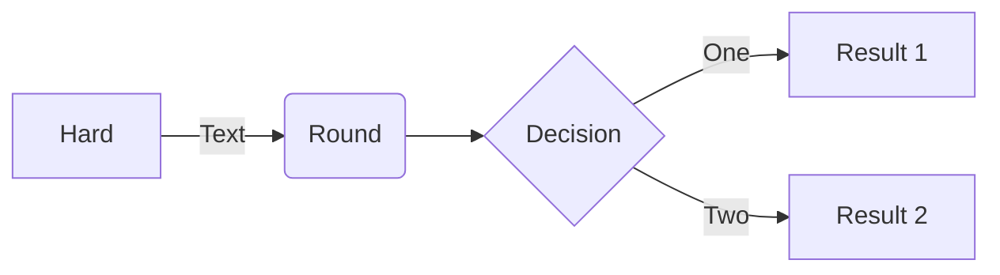
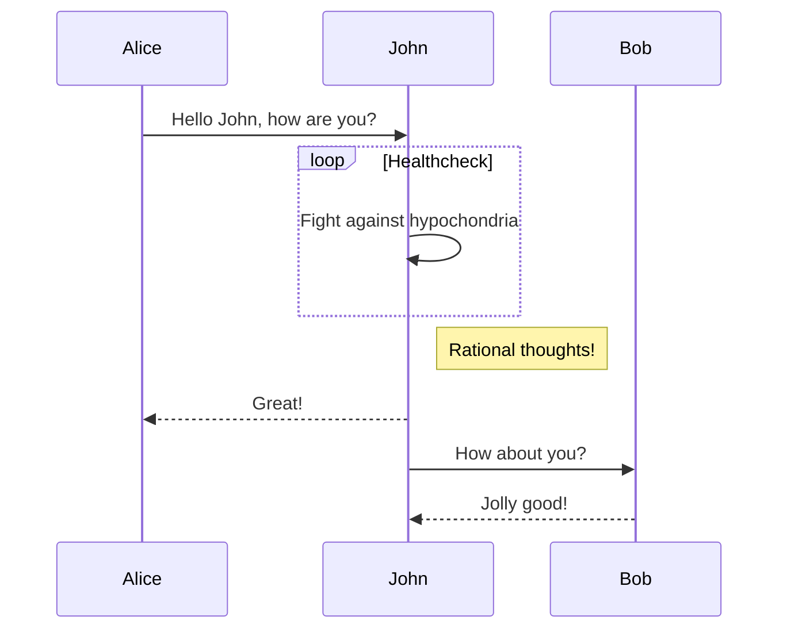
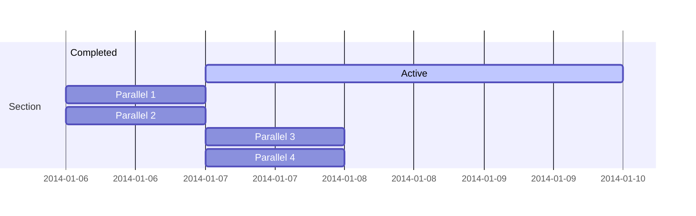
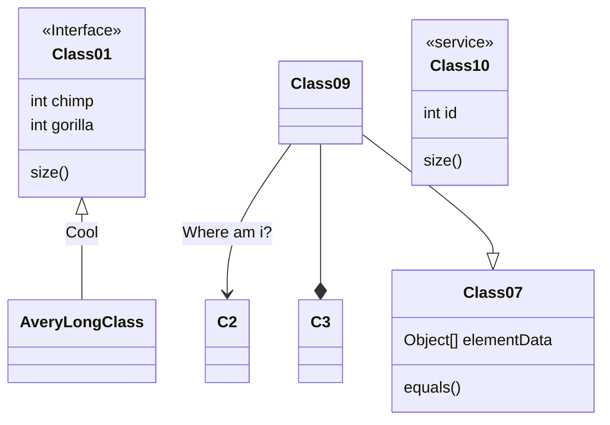
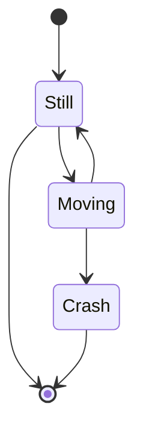
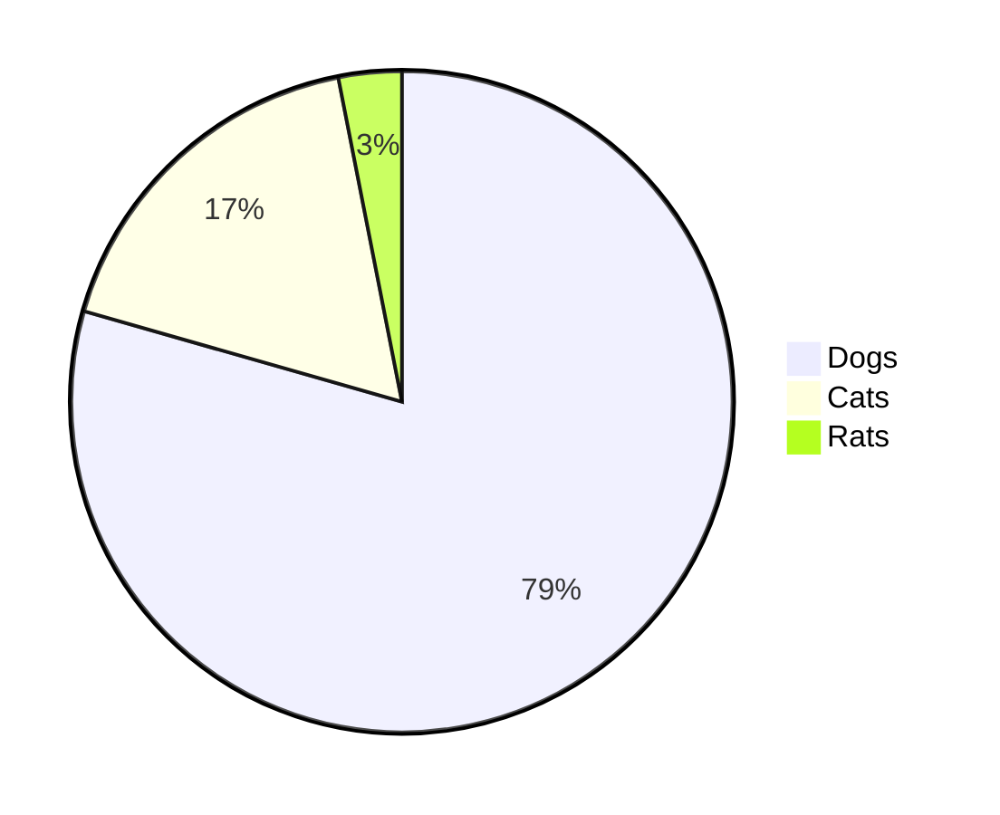
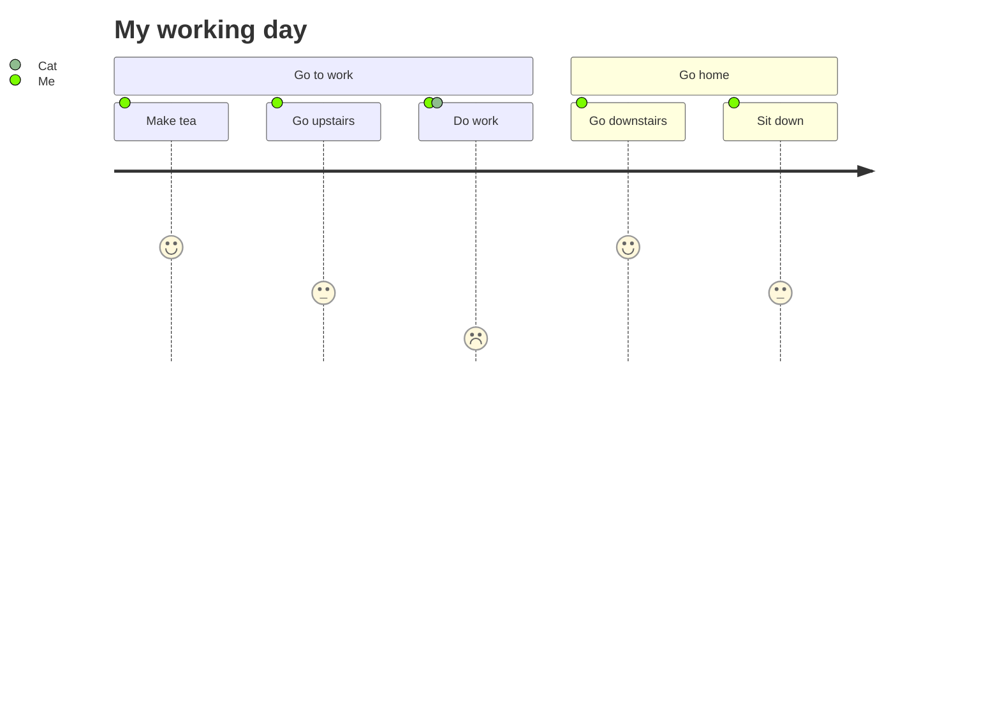

# Mermaid-js

简单的 markdown 文本生成图表和流程图

# 在线编辑器

[mermaid.live](https://mermaid.live/)

# 示例

## 流程图

[文档](https://mermaid-js.github.io/mermaid/#/flowchart)

## 时序图

## 甘特图

## 类图

## 状态图

## 饼图

## 用户体验旅程图

